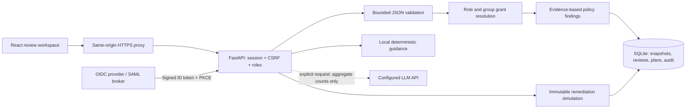

# Identity Risk Workbench — Alan Vo

Current version: `1.0.0`.

An identity governance review workspace: import an identity export, trace effective access through
nested groups and inherited roles, investigate risk findings, and preview remediation before
changing production. FastAPI, React/TypeScript, SQLite and container deployment; optional
aggregate-only LLM advice. No identity-provider credentials or live mutation permissions are needed.

## Product workflows

1. **Evidence intake:** validate a JSON snapshot, tune analysis policy, preview findings, then save.
   Imports reject duplicate IDs, unknown references, cycles, ambiguous booleans and invalid dates.
2. **Investigation:** inspect effective roles and permission grant paths; review stale accounts,
   missing or unknown MFA, ownerless services, toxic permissions and concentrated grants.
3. **Controlled remediation:** preview role or group removal, disabling an identity or assigning an
   owner. Another authenticated reviewer must approve a proposed plan. Plans never execute changes.
4. **Accountability:** annotate findings with version-protected decisions, export JSON or safe CSV,
   and inspect bounded audit history. Original snapshot analysis remains unchanged by review decisions.



## Run locally

Requires Python 3.12+ and Node 22+. No API key is needed for analysis or local guidance.

```bash
git clone https://github.com/ALANDVO/identity-risk-workbench-alan-vo.git
cd identity-risk-workbench-alan-vo
python3 -m venv .venv
. .venv/bin/activate
pip install -r backend/requirements.txt
cp .env.example .env
set -a
. ./.env
set +a
PYTHONPATH=backend uvicorn app.main:create_app --factory --host 127.0.0.1 --port 8021 --no-proxy-headers
```

In another terminal:

```bash
cd frontend
npm ci --no-audit --no-fund
npm run dev
```

Open **http://127.0.0.1:5173**, enter the local demo as Administrator, and import
[`examples/identity-export.json`](examples/identity-export.json). The demo is explicitly opt-in,
refused in production, and restricted to loopback clients. Do not expose it through a public tunnel.
To demonstrate two-person approval, propose a plan as one demo persona, sign out, and sign in as
Independent reviewer. Demo personas are not real authenticated identities.

## Production and SSO/SAML

Production uses OIDC authorization code flow with PKCE. ID tokens require RS256 or ES256 signatures,
issuer, audience, expiration, issued-at time, subject and nonce; multi-audience tokens also require
matching authorized party. Sessions are server-side and revocable, with HttpOnly/Secure/SameSite
cookies. Mutations require the session's `X-CSRF-Token` and the appropriate role.

Register an OIDC client with your provider and exact callback
`https://your-host/api/auth/callback`. Configure:

| Variable | Purpose |
| --- | --- |
| `OIDC_DISCOVERY_URL` | Issuer URL ending in `/.well-known/openid-configuration` |
| `OIDC_CLIENT_ID` | Registered client ID |
| `OIDC_CLIENT_SECRET` | Secret for confidential clients; optional for public PKCE clients |
| `OIDC_REDIRECT_URI` | Exact HTTPS callback URL |
| `FRONTEND_URL` | HTTPS origin of the frontend, without a path |
| `OIDC_ROLE_CLAIM` | Dot-separated role claim; default `realm_access.roles` |
| `SESSION_TTL_SECONDS` | Server session lifetime; default 28,800 seconds |

Use `viewer` for read/export, `reviewer` for imports, finding decisions and plan proposals/approval,
and `admin` for all operations including deletion and audit. Unrecognized roles receive viewer
access. This is a **single organizational workspace**, not a tenant-isolation system: every admitted
viewer can read every snapshot. Restrict admission at the identity provider.

For **SAML**, configure a broker such as Keycloak: add the enterprise SAML identity provider to a
realm, map its groups to the three application roles, and register this app as an OIDC client in
that realm. Ensure an ID-token mapper emits the configured role claim. The broker validates SAML;
this app validates the broker's OIDC token. It does not parse SAML assertions directly.

Set the production HTTPS variables in `.env`, then:

```bash
docker compose up --build -d
```

Compose forces production OIDC and secure cookies, runs containers without root, stores evidence
in the `evidence` volume, and binds the frontend only at `127.0.0.1:8092`. Put an HTTPS reverse proxy
in front of that port and preserve the public host. The backend is not published to the host.
The example development `.env` is insufficient for production until its URLs and OIDC settings
are replaced. Do not disable secure cookies to work around HTTP deployment.

Use one backend process per SQLite database. Back up the database with SQLite's backup API or a
coordinated volume snapshot that includes WAL state, and test restoration. Protect backups as
identity data. Exports, imported JSON, names and review notes remain in the local database.

## LLM configuration

`LLM_API_KEY` is the only credential variable. With an OpenAI key, that alone enables the default
adapter. For another provider set its non-secret routing fields. Requests occur only when a
reviewer selects **Send aggregate counts for AI advice**; no automatic background API calls occur.

| `LLM_PROVIDER` | Default endpoint | Default model |
| --- | --- | --- |
| `openai` or `openai-compatible` | `https://api.openai.com/v1` | `gpt-4o-mini` |
| `anthropic` | `https://api.anthropic.com/v1` | `claude-sonnet-4-6` |
| `gemini` | `https://generativelanguage.googleapis.com/v1beta/openai` | `gemini-2.5-flash` |
| `ollama` | `http://127.0.0.1:11434/v1` | `llama3.2` |

Override `LLM_BASE_URL` and `LLM_MODEL` to use an available model or any compatible proxy. Ollama
requires the selected model to be installed and needs no key for local use. In containers, point
the adapter at a reachable endpoint; the container's loopback is not the host. Non-loopback
endpoints require HTTPS. Defaults are configurable examples, not a promise of current availability.

The adapter uses [Claude Messages](https://platform.claude.com/docs/en/api/messages/create),
[Gemini's OpenAI compatibility interface](https://ai.google.dev/gemini-api/docs/openai), or
[Ollama's compatible endpoint](https://docs.ollama.com/api/openai-compatibility).
It sends only summary counts and fixed instructions, never identities, role names, grant paths or
notes. Responses are bounded, displayed as text, and cannot execute tools or modify reviews.
Failures preserve local guidance without exposing upstream response bodies. Provider billing and
model availability are controlled by your account; no live provider calls are made by tests or CI.

## AI/ML evaluation

The application combines explicit policy analysis with optional LLM-assisted review. Its risk
score is **not a learned compromise probability**. A reproducible synthetic benchmark calibrates
inactivity thresholds against independent lifecycle labels, using separate training and held-out
seeds. It deliberately includes dormant legitimate users and recently active departed users.

```bash
PYTHONPATH=backend python -m app.services.evaluation
```

The checked-in [evaluation results](docs/evaluation.json) use 200 identities per split. Training
selects 120 days; on held-out data the default 90-day policy has precision 0.4667, recall 0.7143,
F1 0.5645, while the selected policy has precision 0.7391, recall 0.6939, F1 0.7158. It still makes
12 false positives and misses 15 cases. These are synthetic results, not production accuracy.
Evaluation never changes workspace policy and does not evaluate the quality of generated advice.
The same benchmark is available in the UI's Policy evaluation tab.

## API reference

Interactive schema: `/docs`; OpenAPI: `/openapi.json`. Authenticate through the browser's OIDC flow
and use its cookie session. `/api/auth/me` returns the CSRF token. JSON mutations send
`Content-Type: application/json` and `X-CSRF-Token`; multipart imports also require that CSRF header.

| Method and route | Contract |
| --- | --- |
| `GET /health` | Public status and version |
| `GET /api/auth/mode` | Public login mode |
| `GET /api/auth/login` | Redirect to OIDC with state, nonce and PKCE |
| `GET /api/auth/callback` | Consume state and exchange/verify identity token |
| `POST /api/auth/demo?identity=admin` | Local demo only; personas `admin`, `analyst`, `reviewer` |
| `GET /api/auth/me` | Session subject, name, roles and CSRF token |
| `POST /api/auth/logout` | Revoke current session |
| `GET /api/policy` | Default analysis policy |
| `POST /api/import/preview` | Multipart `file`, optional JSON `policy`; analyze without storing |
| `POST /api/snapshots` | Multipart `file`, `name`, optional JSON `policy`; idempotent exact-byte import |
| `GET /api/snapshots` | Snapshot metadata, newest first |
| `GET /api/snapshots/{id}` | Analysis, reviews and plans |
| `POST /api/snapshots/{id}/reviews/{finding}` | `{decision,note,version}`; initial version 0 |
| `POST /api/snapshots/{id}/plans/preview` | `{actions}`; side-effect-free simulation |
| `POST /api/snapshots/{id}/plans` | `{title,actions}`; save a proposed plan |
| `POST /api/snapshots/{id}/plans/{plan}/decision` | `{state,note,version}`; different reviewer; `approved` or `rejected` |
| `POST /api/snapshots/{id}/advice` | `{external:false}` for local guidance; explicit `true` for configured provider |
| `GET /api/snapshots/{id}/export/{format}` | Download `json` or formula-neutralized `csv` |
| `DELETE /api/snapshots/{id}?version=1` | Admin-only deletion, including associated reviews and plans |
| `GET /api/audit?limit=100&before=123` | Admin audit cursor; maximum 500 records per request |
| `GET /api/evaluation` | Reproducible synthetic policy benchmark |

A plan action has `kind` and `identity_id`. `remove_role`, `remove_group` and `assign_owner` also
require a string `value`. Only direct grants can be removed. `disable` takes no `value`.
A conflicting reviewer version returns 409; refresh before attempting another save. Invalid
inputs return 422, missing records 404, authentication failures 401 and permission/CSRF failures
403. External advice is rate-limited to one request per session subject per 30 seconds in the
single-process deployment.

## Verification and operating limits

```bash
PYTHONPATH=backend pytest backend/tests -q
npm --prefix frontend ci --no-audit --no-fund
npm --prefix frontend test -- --run
npm --prefix frontend run build
docker build -f backend/Dockerfile -t identity-risk-backend:test .
docker build -f frontend/Dockerfile -t identity-risk-frontend:test .
```

Tests cover malformed imports, inheritance, wildcard semantics, stale boundaries, unknown MFA,
alternate grants, immutable previews, concurrent review conflicts, independent plan approval,
OIDC signatures/claims/PKCE/replay, authorization, CSRF, provider failures and request privacy.
CI runs these checks and both image builds on standard public-repository runners, without API
secrets, paid model calls or image publication.

Limits: 5 MiB/export; 10,000 identities; 1,000 roles and groups each; 30,000 declared edges;
200,000 effective role/permission grants; 25 snapshots; 100 plans/snapshot; latest 5,000 audit
events. Concentration counts permission strings, not the semantic power of wildcard grants.
No deny policies, resource conditions or provider-specific semantics are modeled. Consult the
[analysis contract](docs/analysis-contract.md) before using normalized production exports.

---
Alan Vo · [alanvo@gmail.com](mailto:alanvo@gmail.com) · [GitHub](https://github.com/ALANDVO)
